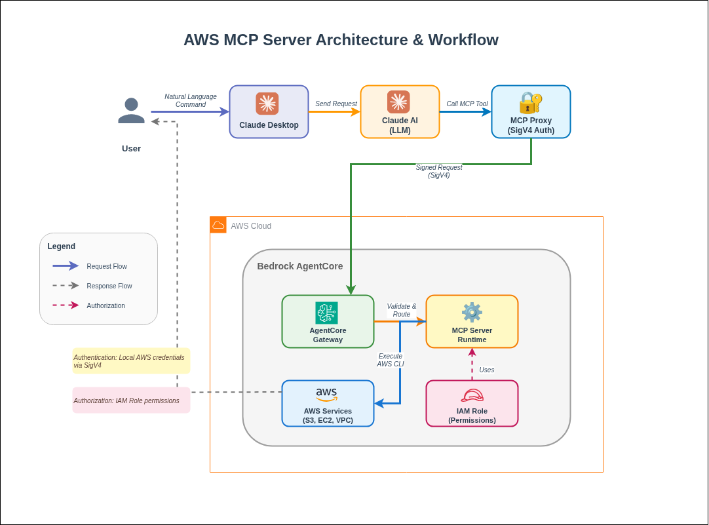

# AWS MCP Server Deployment With Claude
This guide provides complete instructions for deploying the AWS API MCP Server to Amazon Bedrock AgentCore. This setup enables you to use natural language commands in Claude Desktop to manage AWS resources through the Model Context Protocol (MCP).

